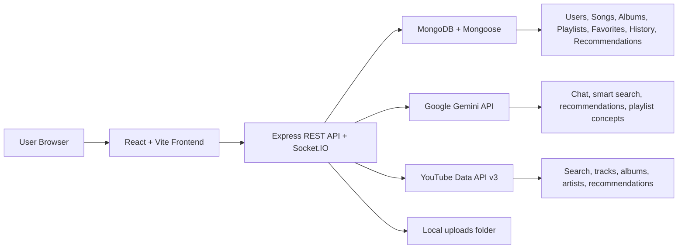

# MelodyMind - AI Music Streaming App

MelodyMind is a full-stack music streaming and discovery platform built for an educational portfolio project. It combines a React frontend, Express API, MongoDB data models, YouTube Data API music discovery, and Google Gemini-powered AI features such as smart search, AI chat, personalized recommendations, and playlist generation.

## Features

- Listener, artist, and admin authentication with JWT.
- YouTube-powered search, track details, album details, new releases, and recommendations.
- Local music library with artist uploads for songs, albums, podcasts, lyrics, cover art, and metadata.
- Music player, queue, now-playing view, favorites, downloads, listening history, and playlists.
- AI chat for music questions and local-library recommendations.
- AI playlist generation with source labels for YouTube API and local library tracks.
- Personalized AI recommendations based on listening history, favorite genres, local library signals, and time context.
- Recommendation history page showing previous AI recommendations and their sources.
- Smart natural-language search by mood, genre, year, artist, album, or remembered lyrics.
- Artist studio for uploads and content management.
- Admin dashboard for users, artists, songs, albums, reports, analytics, and moderation.
- Graceful fallbacks when Gemini or YouTube is unavailable, rate limited, or missing an API key.

## Architecture



### Request Flow

1. The React frontend calls the Express API through Axios services.
2. Express validates requests, checks JWT auth where required, and calls controllers.
3. Controllers read and write MongoDB through Mongoose models.
4. AI endpoints call Gemini for analysis and YouTube for external music results.
5. If Gemini fails, the backend uses predefined local fallback profiles.
6. If YouTube fails or quota expires, the backend returns local library results or an empty state with a useful warning.

## Tech Stack

### Frontend

- React 19
- Vite
- React Router
- Tailwind CSS
- Framer Motion
- Axios
- Socket.IO Client
- React Hot Toast
- React Icons

### Backend

- Node.js
- Express 5
- MongoDB
- Mongoose
- JWT authentication
- bcrypt password hashing
- Socket.IO
- Multer file uploads
- Helmet
- CORS
- Express Rate Limit

### External APIs

- Google Gemini API
- YouTube Data API v3


## Demo Credentials

Use these accounts for local demos after running the seed command.

| Role | Email | Password |
| --- | --- | --- |
| Listener | `listener@melodymind.demo` | `Listener123` |
| Artist | `artist@melodymind.demo` | `Artist123` |
| Admin | `admin@melodymind.demo` | `Admin123` |

Seed the accounts:

```bash
cd backend
npm run seed:demo
```

## Setup Instructions

### Prerequisites

- Node.js 18 or newer
- MongoDB local server or MongoDB Atlas database
- YouTube Data API v3 key
- Google Gemini API key

### 1. Clone and Install

```bash
git clone <your-repository-url>
cd music-ai-streaming-app

cd backend
npm install

cd ../frontend
npm install
```

### 2. Configure Environment Variables

Copy the backend example file:

```bash
cd backend
cp .env.example .env
```

### 3. Start the Backend

```bash
cd backend
npm run dev
```

Backend URL:

```txt
http://localhost:5000
```

### 4. Start the Frontend

```bash
cd frontend
npm run dev
```

Frontend URL:

```txt
http://localhost:5173
```

### 5. Optional: Seed Demo Users

```bash
cd backend
npm run seed:demo
```

## API List

Base URL:

```txt
http://localhost:5000/api
```

### Auth

- `POST /auth/register` - Register a listener account.
- `POST /auth/login` - Login and receive a JWT.
- `GET /auth/profile` - Get current authenticated user.
- `PUT /auth/profile` - Update profile details.
- `PUT /auth/change-password` - Change password.
- `POST /auth/profile/image` - Upload profile image.
- `DELETE /auth/delete-account` - Delete the authenticated account.
- `POST /auth/logout` - Logout response.

### Music / YouTube

- `GET /music/search?q=&type=&limit=` - Search YouTube music results.
- `GET /music/track/:id` - Get YouTube track details.
- `GET /music/artist/:id` - Get YouTube channel/artist details.
- `GET /music/artist/:id/related` - Get related artists.
- `GET /music/album/:id` - Get playlist/album details.
- `GET /music/new-releases?limit=` - Get YouTube-based new releases.
- `GET /music/recommendations` - Get YouTube recommendations.
- `GET /music/featured-playlists` - Get featured YouTube playlists.

### Local Library

- `GET /library/search` - Search local songs, albums, podcasts, and artists.
- `GET /library/trending` - Get trending local library content.
- `GET /library/artists` - Get local artists.
- `GET /library/artists/:name` - Get local artist details.
- `GET /songs` - List local songs.
- `POST /songs` - Upload a song.
- `POST /songs/:id/cover` - Upload song cover.
- `GET /albums` - List local albums.
- `POST /albums` - Create local album.
- `POST /albums/:id/cover` - Upload album cover.
- `POST /albums/:id/songs` - Add song to album.
- `GET /podcasts` - List podcasts.
- `POST /podcasts` - Upload podcast.

### AI

- `POST /ai/chat` - Ask the music assistant.
- `POST /ai/recommend` - Generate personalized or prompt-based recommendations.
- `POST /ai/generate-playlist` - Generate an AI playlist concept and tracks.
- `POST /ai/smart-search` - Parse natural-language music search.
- `POST /ai/lyrics` - Search local songs by remembered lyrics.
- `GET /ai/history` - Get AI chat/action history.
- `GET /ai/recommendations` - Get scored local recommendations.

### User Music Data

- `POST /users/listening-history` - Record a played track.
- `GET /users/listening-history` - Get listening history.
- `GET /users/recently-played` - Get recent tracks.
- `GET /users/most-played` - Get most played tracks.
- `GET /users/continue-listening` - Continue listening list.
- `PUT /users/favorite-genres` - Update favorite genres.
- `GET /users/chat-history` - Get saved chat messages.
- `GET /users/recommendation-history` - Get saved recommendation history.
- `DELETE /users/recommendation-history/:id` - Delete one saved recommendation history entry.

### Playlists, Favorites, Downloads, Follow

- `GET /playlists` - Get user playlists.
- `POST /playlists` - Create playlist.
- `GET /playlists/:id` - Get playlist details.
- `PUT /playlists/:id` - Update playlist.
- `DELETE /playlists/:id` - Delete playlist.
- `POST /playlists/:id/songs` - Add song to playlist.
- `DELETE /playlists/:id/songs/:songId` - Remove song from playlist.
- `GET /favorites` - Get favorites.
- `POST /favorites` - Add favorite.
- `DELETE /favorites/:id` - Remove favorite.
- `GET /downloads` - Get downloads.
- `POST /downloads` - Save download record.
- `DELETE /downloads/:id` - Remove download.
- `POST /follow/:userId` - Follow an artist.
- `DELETE /follow/:userId` - Unfollow an artist.

### Admin

- `GET /admin/dashboard` - Dashboard statistics.
- `GET /admin/analytics` - Analytics data.
- `GET /admin/reports` - Reports data.
- `GET /admin/settings` - Platform settings.
- `GET /admin/users` - List users.
- `PATCH /admin/users/:id` - Update user.
- `DELETE /admin/users/:id` - Delete user and related data.
- `GET /admin/artists` - List artists.
- `POST /admin/artists/:id/approve` - Approve artist.
- `POST /admin/artists/:id/suspend` - Suspend artist.
- `DELETE /admin/artists/:id` - Delete artist.
- `GET /admin/songs` - List songs.
- `PATCH /admin/songs/:id` - Update song.
- `DELETE /admin/songs/:id` - Delete song.
- `GET /admin/albums` - List albums.
- `PATCH /admin/albums/:id` - Update album.
- `DELETE /admin/albums/:id` - Delete album.

## AI Explanation

MelodyMind uses Gemini and local fallback logic together.

- Gemini is used for chat, natural-language search parsing, personalized recommendation summaries, and playlist concepts.
- YouTube Data API is used for external music discovery and streaming metadata.
- MongoDB stores users, local songs, albums, playlists, listening history, favorites, downloads, AI history, and recommendation history.
- Local fallback profiles are used when Gemini is unavailable, missing an API key, over quota, or blocked by network/API errors.
- YouTube fallbacks return local library results where possible, or a clear empty state such as: `YouTube recommendations are temporarily unavailable. Try again later or upload local songs.`
- Recommendation cards and history entries show source labels, including `Gemini analysis`, `YouTube API`, `Local library`, and `User listening history`.

## API Limits and Fallback Behavior

- YouTube quota/key/network failures return friendly warnings instead of unexplained 500 errors on list endpoints.
- Gemini failures return fallback AI profiles and warnings when relevant.
- Debug details stay behind environment flags:
  - `DEBUG_GEMINI=true`
  - `DEBUG_YOUTUBE=true`
  - `DEBUG_SOCKET=true`
  - `DEBUG_REQUESTS=true`
  - `DEBUG_ERRORS=true`

## Known Limitations

- This is an educational portfolio project, not a production music licensing platform.
- YouTube Data API quotas can expire quickly during repeated searching.
- YouTube playback depends on available YouTube metadata and client/browser behavior.
- Gemini quality depends on the configured model, API key, network, and quota.
- Password reset by email was intentionally removed to keep the project scope appropriate for a CV/demo app.
- Demo accounts are local seed accounts and should not be used as real production credentials.
- Uploaded media is stored in the local backend uploads folder; production deployment should use cloud storage.
- Screenshots should be captured from your final local UI before publishing the repository.

## Code Quality Notes

- Request validation is handled with custom validators and middleware.
- Central error handling returns consistent JSON error responses.
- Rate limiting is enabled for API routes.
- Debug logging is disabled by default and controlled through environment flags.
- Recommendation history stores clean source metadata for explainability.
<<<<<<< HEAD

=======
>>>>>>> eb858103c731443df6b9c41391f34ccde41e573f
